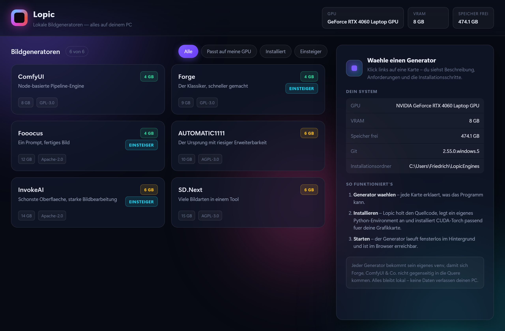

# Lopic

Lokale Bildgeneratoren auf deinem PC installieren und starten — mit schicker Oberfläche.

Lopic ist kein Bildgenerator, sondern ein **Verwalter**: er zeigt dir die verfügbaren
Stable-Diffusion-Werkzeuge, erklärt sie, installiert sie inklusive passender
CUDA-Torch-Version und startet sie fensterlos im Hintergrund.



## Was Lopic kann

- **Sechs Generatoren** mit Beschreibung, VRAM-Bedarf, Lizenz und Installationsschritten
- **Automatische Hardware-Erkennung**: GPU, VRAM, freier Speicher, Git/uv/Python
- **VRAM-Abgleich**: Karten werden grün/gelb/rot markiert, je nachdem ob deine GPU reicht
- **Ein-Klick-Installation** mit Live-Log und Fortschrittsbalken
- **Eigenes Python-Environment pro Generator**, damit sie sich nicht in die Quere kommen
- **Fensterloser Start**: kein Konsolenfenster, kein Fokus-Stehlen

## Die sechs Generatoren

| Generator | Wofür | Python | VRAM | Start |
|---|---|---|---|---|
| **ComfyUI** | Node-basierte Pipeline-Engine, mächtigste und sparsamste Option | 3.12 | 4 GB | `main.py` |
| **Forge** | Nachfolger von A1111, gleiche Oberfläche, schneller und sparsamer | 3.10 | 4 GB | `launch.py` |
| **Fooocus** | Nur Prompt eingeben, fertiges Bild — der einfachste Einstieg | 3.10 | 4 GB | `launch.py` |
| **AUTOMATIC1111** | Das Original mit dem größten Erweiterungs-Ökosystem | 3.10 | 6 GB | `launch.py` |
| **InvokeAI** | Schonste Oberfläche mit Canvas und Bildbearbeitung | 3.12 | 6 GB | `invokeai-web` |
| **SD.Next** | Bild-, Video- und 3D-Generierung in einem Tool, sehr aktiv gepflegt | 3.12 | 6 GB | `launch.py` |

Alle Angaben zu Quellcode, Startdatei, `requirements`-Dateinamen **und Python-Version**
sind gegen die tatsächlichen Repositories geprüft, nicht geraten. Das ist nicht
kosmetisch: Forge, Fooocus und A1111 lehnen auf Windows jedes andere Python-Minor-Release
ab — Forge und A1111 brechen mit `INCOMPATIBLE PYTHON VERSION` ab, Fooocus beendet die
Installation mit `exit(0)`. Lopic legt darum für jeden Generator ein eigenes venv in der
jeweils gepinnten Version an.

## Installation

```bat
git clone https://github.com/<dein-name>/Lopic.git
cd Lopic
uv venv --python 3.12 .venv
uv pip install --python .venv\Scripts\python.exe -r requirements.txt
start.bat
```

Ohne `uv` geht auch das klassische `python -m venv .venv` + `pip install -r requirements.txt`.

Voraussetzungen: Windows 10/11, WebView2 Runtime (mit Windows und Edge mitgeliefert),
Git, Python 3.11/3.12 für die Generatoren, NVIDIA-Treiber.

## Wo landet was

| Pfad | Inhalt |
|---|---|
| `%APPDATA%\Lopic\config.json` | Einstellungen und Fenstergröße |
| `~\LopicEngines\<Generator>` | Quellcode, eigenes `venv`, Modelle |

Modelle laden die Generatoren selbst nach. Für den ersten Start plane grob **10–20 GB**
pro Generator ein, plus die Modelldateien.

## Projektstruktur

```
lopic/
  app.py        Fenster + Python<->JS-Bridge
  catalog.py    die sechs Generatoren mit allen Metadaten
  install.py    Installations-Orchestrator (clone, venv, torch, deps)
  settings.py   Konfiguration unter %APPDATA%
  system.py     GPU-/VRAM-/Disk-Erkennung
ui/
  index.html    Markup
  style.css     Gestaltung
  app.js        Frontend-Logik
```

## Technische Notizen

- **UI**: WebView2 (Edge) über `pywebview`, reines HTML/CSS/JS. Damit sieht die
  Oberfläche aus wie eine Web-App statt wie ein klassisches Fenster.
- **Warum kein `--listen`**: die Generatoren binden nur an `127.0.0.1`. Ein
  `--listen` ohne Argument würde die Oberfläche im ganzen Netzwerk freigeben.
- **pywebview 6.x**: `create_window(loaded=...)` existiert nicht mehr, Events hängen
  an `window.events.loaded`. Das `pywebviewready`-DOM-Event feuert, *bevor* Inline-Skripte
  ihre Listener registrieren können — deshalb startet das Frontend über einen Kick aus
  Python (`_kick_frontend`) statt über einen JS-Listener.

## Lizenz

Der Code in diesem Repository steht unter der MIT-Lizenz. Die installierten Generatoren
haben jeweils eigene Lizenzen (GPL-3.0, AGPL-3.0, Apache-2.0) — siehe die Karten.